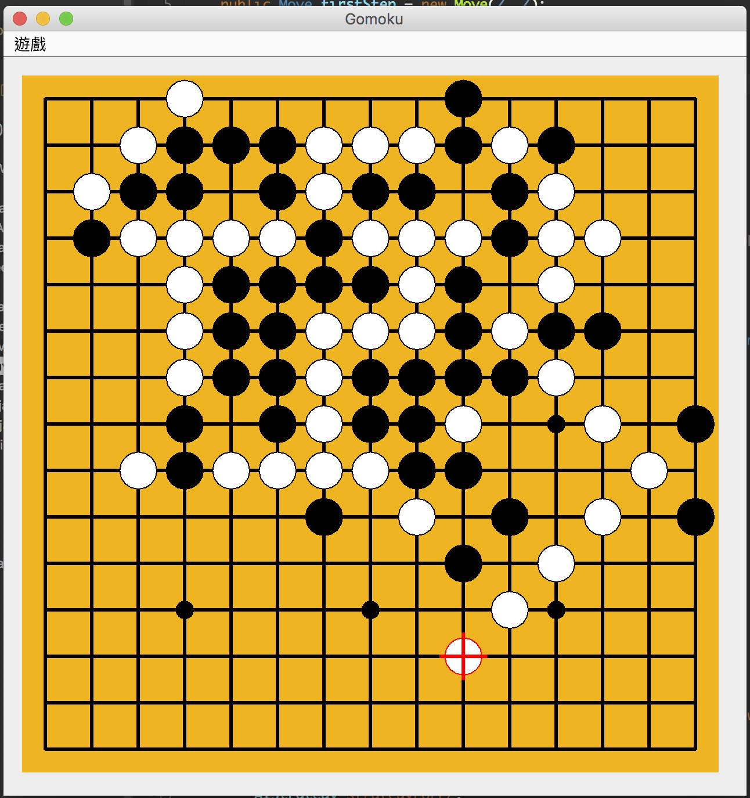
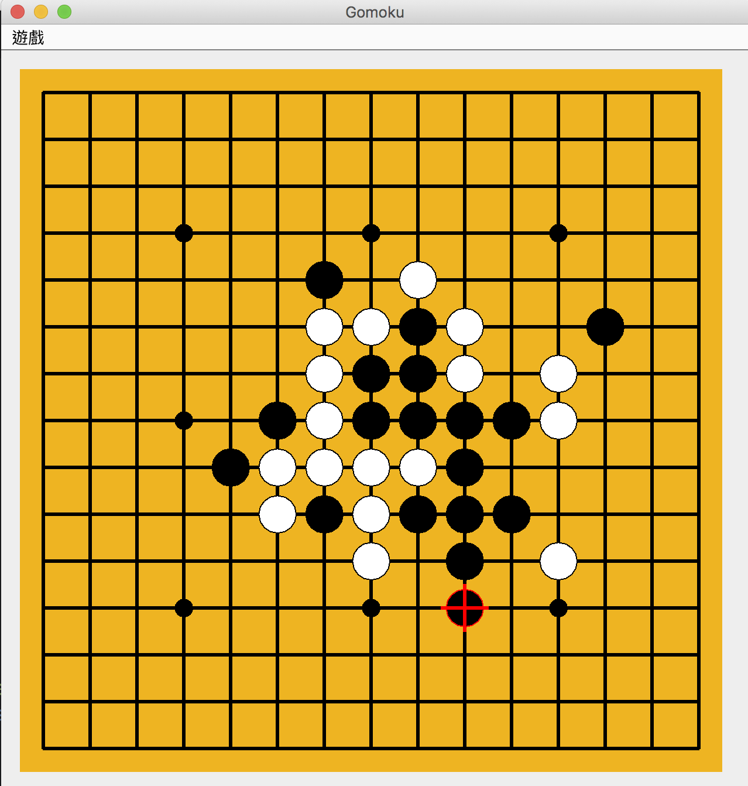
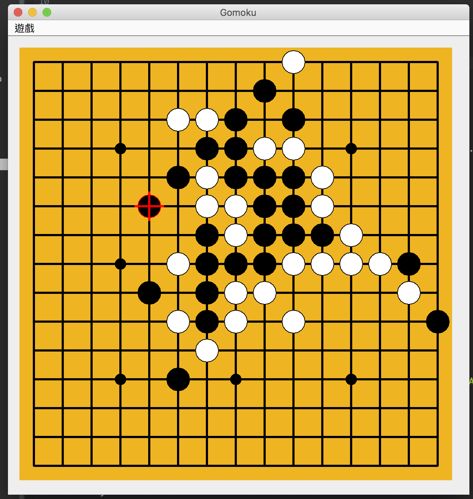
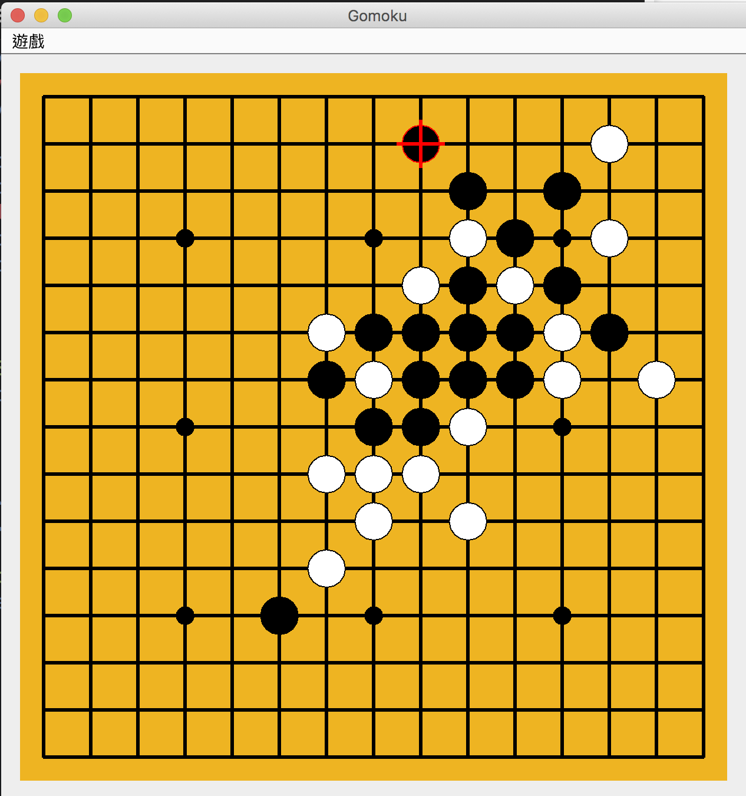

# Gomoku-AI2AI

## Setup
### Define first, (second) steps for player1(black)
```
// In class GameModel

// Set first move and second move for player 1
public Move firstStep = new Move(7, 7);
public Move secStep = new Move(7, 4);
```
### Choose between rules to follow: **Standard/PRO**

- Rule reference: http://gomokuworld.com/gomoku/2

```
// In class GameModel

// Set this to 1 for Standard, 2 for Pro
private int proRuleStepsCnt = 1; 
```


### Set player 1 mode

- Based on minimax+alphabeta, enable/disable **finding must kill algorithm**

```
// In class GameModel

// Enable minimax+AB with/without finding must kill steps
private boolean player1_findMustKillEnabled = true; 
```

### Set player 2 mode
- 0 -> minimax + alpha
- 1 -> Greedy

```
// 0 for minimax, 1 for greedy
private int player2_minimaxOrGreedy = 0; 
```

### Settings in player1's algorithm

#### Search Depth

- Set minimax search depth ( Should be even, <=6, it takes lots of time to perform one step if deeper than 6)
- Set depth for finding must kills

```
// In class AIStrategyABAndMustKill
..

int minimaxDepth = 4; // Should be even WHEN this is a max node
int findKillDepth = 7;
..
```

#### Enable/Disable Zobrist hash function
- It's for improving calculate speed, main idea is to reduce recalculated states. [REFERENCE](https://www.geeksforgeeks.org/minimax-algorithm-in-game-theory-set-5-zobrist-hashing/)
- The performance improved is about 5% or lower, **NOT GOOD**
- In one of my tests, the result is
  - With zobrist: 85025 ms
  - Without zobrist: 92481 ms
```
// In class AIStrategyABAndMustKill
..

private boolean isZobristEnabled = false;

..
```

## Execution
Run GomokuMain.java

---

# Topic
**Improve Search Based Gomoku AI (by Reducing Search Space)**

## Introduction
In our research, we focus on Gomoku AIs based on adversarial search, such as minimax and alpha-beta pruning.
In a basic minimax algorithm, the search depth is barely over 4 even if alpha-beta pruning is applied. We observed that for each min or max, the number of possible steps generated by the generating function is dominant for the search space, which can cost high computating efforts. We're presenting some techniques to solve this problem to make the search space smaller and possibly deeper with the search depth. 

## Reward

### Patterns
- Fives: 100000
- open fours: 10000
- open three: 1000
- open two: 100
- open one: 10
- closed four: 1000
- closed three: 100
- closed two: 10
- closed one: 1

## Algorithms (Design process & details)

### 1. Initial design of  basic minimax with alpha-beta pruning

- Generating function for possible traverse steps
- It searches for empty spaces which are near the previous move or any existing moves (3x3 or 5x5 range).

- It's **NOT** taking the reward of each step into consideration, just traversing exhaustively.


- Evaluation of Board
    - Finding the patterns on the board, sum all the rewards of each pattern of each player individually.

    - We take (**sum of our score**) - (**sum of opponent's score**) as output.

    - It's a good indicator for the situation of the current state.
        - Example: If positive, then it's more likely that we're dominant in this state.

- Performance: 
    - Depth=4, the waiting time is a bit long, but acceptable.
    - **CAN'T GO DEEPER**

### 2. Redesigning the generating function
The main idea of this is to reduce the space of possible steps in each level.

#### Evaluation of individual space on the board
We used another evaluation function that's similar to the one for board. 
This function calculates rewards for each space.
Store each reward with different situations:
    1. Put black
    2. Put white
    3. Empty

#### Possible steps generating hierarchy
Based on the reward calculated by the function above.
The steps having higher reward have higher priority to form the possible steps.
All steps on the board are partitioned by the Reward values we designed.
We return the steps from highest down to lowest reward ones. If one higher level does not have any possible move, then we continue to check the next lower level. In the last level, we further restrict the steps returned to be below 40 which lowers the space in the next level.

- Compare to original one
    - The possible steps are generated with reference to reward values.
    - It's more reasonable and reduces the time traversing the irrelevant steps.
    - The search space is **smaller** and **better**


### 3. Extending Search depth

After using the redesigned generating function, the performance is quite good when depth is 4. But with deeper depth, the performance dropped rapidly. However, the strength of such an AI with depth 4 is weak. We need the AI to be able to think of more than 4 moves.

The main idea we use here to extend the depth is **continuing the search** after the four level minimax. 
The continued search is about the same structure with minimax, but reduced the search space further more. Possible next steps are generated only if they're higher they a designated reward value, let's say, **CLOSED FOUR**, which means that we only want steps that have dominant effect on the game. 

- Compare
    - It can search deeper(minimax 4 + extended search 5~7), giving our AI more strength to play
    - The time to calculate increased, but it's much lower than applying the original minimax with such depth

### 4. Reduce recalculating states

Some states might have been calculated before. To decrease the time of recalculation. For each state of board, we store the reward with this Zobrist hash approach.

#### Zobrist Hash
- It's for improving calculate speed, main idea is to reduce recalculated states.
- The performance improved is about 5% or lower, **NOT TOO GOOD**
- In one of my tests, the result is
  - With zobrist: 85025 ms
  - Without zobrist: 92481 ms


## Summarization of Improvements 
- Next step generating function
    - Reduce search space
- Extended Search algorithm
    - Extend search depth


## Evaluation
We implemented the Gomoku Game with JAVA and used JAVA Swing to draw our UI. The game is set up with two AIs playing against each other. We calculate the time, steps made in different matches to show how the result differs when choosing different AIs as opponent.

To evaluate our algorithm, we also designed a **greedy agent**, which only takes the move with the current highest reward as its next step.


### Environment
We performed all the experiments on a macOS x64 machine with 2.3GHz Intel Core i5 CPU and 8GB memory.
- Eclipse IDE for Java Developers
    - Version: Oxygen.1 with JDK 8 (1.8.0)
- Java Swing Library


### Test Matches

(The **minimax** BELOW represents minimax(depth 4) + AB prune + better next step generating function)

- minimax(Black) vs greedy(White)
    - White wins in 43 steps
    <kbd>
    
    </kbd>
- minimax + extended search(depth 5) vs greedy
    - Black wins in 18 steps
    <kbd>
    
    </kbd>

- minimax vs minimax 
    - Black wins in 25 steps
    <kbd>
    
    </kbd>

- minimax + extended search(depth 5) vs minimax
    - Black wins in 18 steps
    <kbd>
    
    </kbd>


From the first match, we found out that a minimax agent with depth 4 is not smarter than a greedy agent who just take the current optimal step.
With extended search applied, the black can win the other in 18 steps.

We also let two exactly same minimax agent play against each other. Comparing the result with/without the extended search, we can see that the one with extended search slightly outperformed the other by fewer steps.


## Reference
- [Searching for Solutions in Games and Articial Intelligence](http://www.dphu.org/uploads/attachements/books/books_3721_0.pdf)

- [Zobrist hash](http://web.archive.org/web/20070810003508/www.seanet.com/~brucemo/topics/zobrist.htm)

- [Docs from Gomocup](http://gomocup.org/download-for-developers/#documents)
